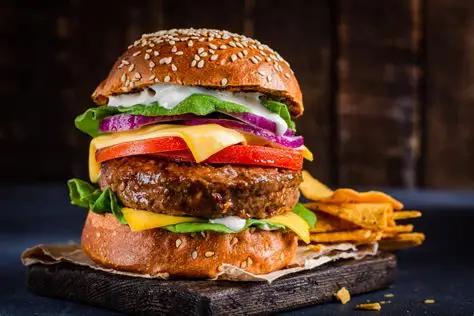

# Ex.07 Restuarant Website
## Date: 08.10.2025

## AIM:
To develop a static Resturant website to display the menu and services provided by the resturant.

## DESIGN STEPS:

### Step 1:
Requirement collection.

### Step 2:
Creating the layout using HTML and CSS.

### Step 3:
Updating the sample content.

### Step 4:
Choose the appropriate style and color scheme.

### Step 5:
Validate the layout in various browsers.

### Step 6:
Validate the HTML code.

### Step 7:
Publish the website in the given URL.

## PROGRAM:
index.html
```
<!DOCTYPE html>
<html lang="en">
<head>
  <meta charset="UTF-8">
  <meta name="viewport" content="width=device-width, initial-scale=1.0">
  <title>TasteHub Restaurant</title>
  <link rel="stylesheet" href="style.css">
</head>
<body>
  <header>
    <h1>TasteHub Restaurant</h1>
    <nav>
      <ul>
        <li><a href="index.html">Home</a></li>
        <li><a href="menu.html">Menu</a></li>
        <li><a href="admin.html">Administrator</a></li>
      </ul>
    </nav>
  </header>

  <section class="hero">
    <h2>Welcome to TasteHub!</h2>
    <p>Fresh food, cozy ambiance, and friendly service await you.</p>
    <a href="menu.html" class="btn">See Our Menu</a>
  </section>

  <section class="gallery">
    <h2>Our Specials</h2>
    <div class="photos">
      
      
      
    </div>
  </section>

  <footer>
    <p>© 2025 TasteHub Restaurant | All Rights Reserved</p>
  </footer>
</body>
</html>

```
menu.html
```
<!DOCTYPE html>
<html lang="en">
<head>
  <meta charset="UTF-8">
  <meta name="viewport" content="width=device-width, initial-scale=1.0">
  <title>Menu - TasteHub</title>
  <link rel="stylesheet" href="style.css">
</head>
<body>
  <header>
    <h1>Our Menu</h1>
    <nav>
      <ul>
        <li><a href="index.html">Home</a></li>
        <li><a href="menu.html">Menu</a></li>
        <li><a href="admin.html">Administrator</a></li>
      </ul>
    </nav>
  </header>

  <section class="menu-page">
    <div class="menu-item">
      
      <h3>Margherita Pizza</h3>
      <p>Classic cheese and tomato pizza.</p>
      <span>₹299</span>
    </div>

    <div class="menu-item">
      
      <h3>Chicken Burger</h3>
      <p>Juicy grilled chicken with fresh lettuce and mayo.</p>
      <span>₹249</span>
    </div>

    <div class="menu-item">
      
      <h3>White Sauce Pasta</h3>
      <p>Creamy Alfredo pasta with herbs.</p>
      <span>₹349</span>
    </div>
  </section>

  <footer>
    <p>© 2025 TasteHub Restaurant | Designed by Kailash Prabhu</p>
  </footer>
</body>
</html>

```
admin.html
```
<!DOCTYPE html>
<html lang="en">
<head>
  <meta charset="UTF-8">
  <meta name="viewport" content="width=device-width, initial-scale=1.0">
  <title>Administrator - TasteHub</title>
  <link rel="stylesheet" href="style.css">
</head>
<body>
  <header>
    <h1>Administrator Panel</h1>
    <nav>
      <ul>
        <li><a href="index.html">Home</a></li>
        <li><a href="menu.html">Menu</a></li>
        <li><a href="admin.html">Administrator</a></li>
      </ul>
    </nav>
  </header>

  <section class="admin-section">
    <h2>Admin Login</h2>
    <form>
      <label>Username:</label><br>
      <input type="text" placeholder="Enter Username"><br><br>
      <label>Password:</label><br>
      <input type="password" placeholder="Enter Password"><br><br>
      <button type="submit">Login</button>
    </form>
  </section>

  <footer>
    <p>© 2025 TasteHub Restaurant | Admin Access Only</p>
  </footer>
</body>
</html>

```

## OUTPUT:


## RESULT:
The program for designing software company website using HTML and CSS is completed successfully.
